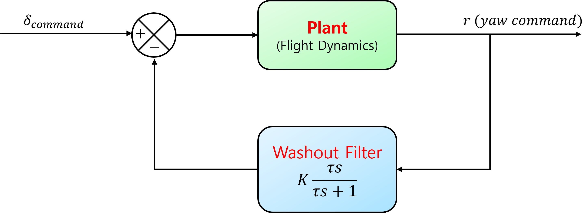

<div align="center">

# b747-lateral-flight-control

**B-747 횡방향(lateral) 선형 모델 기반 비행 제어기 설계 & 시뮬레이션 (MATLAB/Simulink)**

</div>

---

## 한 줄 요약
Rudder/Aileron 입력에 대한 **횡방향 동특성 안정화**를 목표로, **Classical control**(lead/lag + wash-out)과 **LQR state feedback**을 설계·비교합니다.

---

## 모델 (Lateral linear model)

본 프로젝트는 B-747의 횡방향 선형 모델을 아래 형태로 다룹니다.

$$
\dot{x} = A x + B u,\qquad y = Cx + Du
$$

- 상태벡터:

$$
x = \begin{bmatrix}\beta & r & p & \phi\end{bmatrix}^T
$$

- 입력:
  
$$
u = \begin{bmatrix}\delta_r & \delta_a\end{bmatrix}^T
$$

- 출력:
  
$$
y = \begin{bmatrix}r & \phi\end{bmatrix}^T
$$

> \(A,B,C,D\) 및 세부 파라미터는 `matlab/` 내 스크립트/모델에 포함되어 있습니다.

---

## 컨트롤러 구성

### 1) Classical control (Root Locus 기반 튜닝)
SISO 루프에서 lead/lag 보상기를 튜닝하고, yaw damper에 **wash-out filter**를 적용했습니다.

- 보상기(개념):
  
$$
C(s)=K\frac{s+z}{s+p}\quad (\text{lead/lag})
$$

- Wash-out filter(개념):

$$
W(s)=\frac{s}{s+\omega_w}
\quad\left(\omega_w=\frac{1}{T_w}\right)
$$

저주파(지속 선회) 성분은 억제하고, 필요한 감쇠 성분만 통과시키는 용도로 사용합니다.

<p align="center">
  
</p>


---

### 2) LQR state feedback
동일 플랜트에 대해 LQR 기반 상태피드백을 설계하여 성능을 비교했습니다.

- 제어법칙:
  
$$
u = -Kx
$$

- 비용함수:
  
$$
J=\int_0^\infty \left(x^TQx + u^TRu\right)\,dt
$$

<p align="center">
  
</p>

---

## 결과

### Rudder doublet response (비교)
<p align="center">
  
</p>

---

## 레포지토리 구조
```text
.
├─ docs/        # 보고서/설명 이미지 및 문서
├─ matlab/      # MATLAB/Simulink 설계 및 시뮬레이션 파일
└─ results/     # 시뮬레이션 결과 플롯 (이미지)
```

---

## 실행 방법 (MATLAB/Simulink)

### 요구사항
- MATLAB
- Control System Toolbox
- Simulink

## 참고
- MathWorks (Yaw Damper Design for a 747 Jet Aircraft)  
  https://kr.mathworks.com/help/control/ug/yaw-damper-design-for-a-747-jet-aircraft.html


